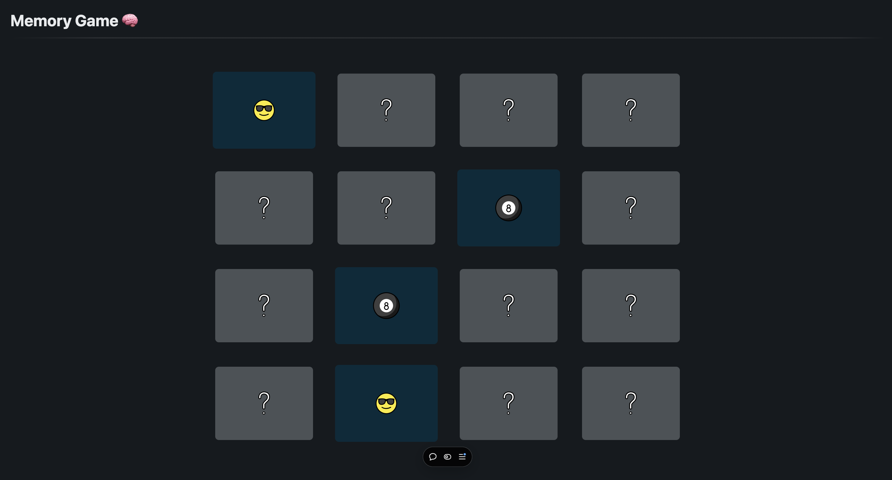

# Memory Game

**Memory Game** is a React-based web app that implements the classic card-matching game. Players test their memory by flipping cards and trying to find matching pairs.

## Live Demo

Visit the live application at: [https://memory-game-vinesk.vercel.app/](https://memory-game-vinesk.vercel.app/)

## Features

- **Card Grid**: Display a grid of face-down cards.
- **Card Flipping**: Click to reveal cards.
- **Matching Logic**: Identify and handle matching pairs.
- **Score Tracking**: Keep track of the number of attempts.
- **Win Condition**: Detect when all pairs have been matched.
- **Responsive Design**: Styled with React components.

## Tech Stack

**Frontend**: React, Next.js  
**Deployment**: Vercel

## Repository

- **Project Repository**: [memory-game](https://github.com/vinesk/memory-game)

## Setup

1. Clone the repo:

   ```bash
   git clone https://github.com/vinesk/lacapsule-memorygame.git
   cd lacapsule-memorygame
   ```

2. Install dependencies:

   ```bash
   npm install
   ```

3. Start the development server:

   ```bash
   npm run dev
   ```

## Usage

- **Start Game**: Load the page to begin a new game.
- **Play**: Click on cards to reveal them and find matching pairs.
- **Win**: Match all pairs to complete the game.

## License

MIT License. See the [LICENSE](./LICENSE) file for details.
